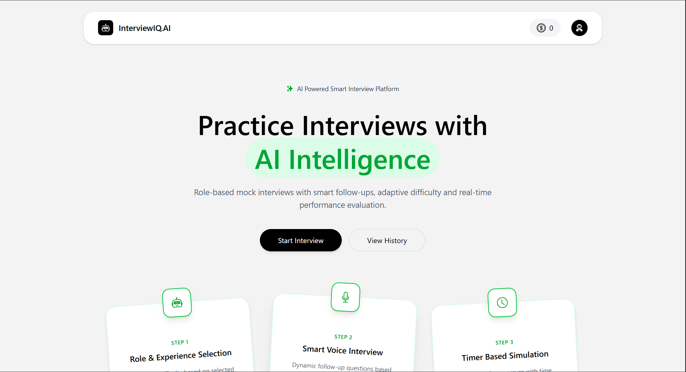

# 🚀 AI Interview Platform (SaaS)

> A full-stack AI-powered mock interview platform with authentication, payments, and a credit-based system — built for real-world usage.

---

## 🌐 Live Demo

🔗 https://ai-interview-shubh.vercel.app

---

## ✨ Highlights

* 🔐 Secure Google Authentication (Firebase)
* 💬 AI-driven Interview Practice System
* 💳 Razorpay Payment Integration (Test + Live)
* 💎 Credit-Based SaaS Model
* 📊 Performance Feedback & Analytics
* 🧠 Scalable Backend with REST APIs
* 🌍 Fully Deployed Production App

---

## 🧠 Problem Statement

Many students lack access to structured interview practice with real-time feedback.
This platform solves that by providing:

* Simulated AI interviews
* Performance insights
* Flexible credit-based usage

---

## ⚙️ Tech Stack

### 🖥️ Frontend

* React.js
* Redux Toolkit
* Tailwind CSS
* Axios

### 🧩 Backend

* Node.js
* Express.js
* MongoDB (Mongoose)

### 🔐 Authentication

* Firebase (Google OAuth)

### 💳 Payments

* Razorpay API

### ☁️ Deployment

* Vercel (Frontend)
* Render (Backend)

---

## 🏗️ System Architecture

```id="arch1"
Client (React) 
   ↓
API (Express Server)
   ↓
MongoDB Database
   ↓
External Services:
   - Firebase Auth
   - Razorpay Payment Gateway
```

---

## 🔑 Key Features

### 🔐 Authentication

* Google Sign-In using Firebase
* Secure session handling (JWT + Cookies)

### 💳 Payment System

* Dynamic order creation
* Razorpay checkout integration
* Server-side payment verification
* Credit allocation after success

### 💎 Credit System

* Free users → limited credits
* Paid users → additional credits
* Credit deduction per interview

### 📊 User System

* User profile management
* Credits tracking
* Premium upgrade flow

---

## 💳 Payment Flow

```id="payflow"
1. User selects plan
2. Backend creates Razorpay order
3. Razorpay checkout opens
4. User completes payment
5. Backend verifies signature
6. Credits added to user account
```

---

## 📂 Project Structure

```id="struct1"
client/
 ├── src/
 │   ├── components/
 │   ├── pages/
 │   ├── redux/
 │   ├── utils/
 │   └── config/

server/
 ├── controllers/
 ├── routes/
 ├── models/
 ├── middlewares/
 ├── services/
 └── config/
```

---

## 🔐 Environment Variables

### 📁 Frontend (`client/.env`)

```id="env1"
VITE_FIREBASE_APIKEY=your_key
VITE_RAZORPAY_KEY_ID=your_key
VITE_SERVER_URL=your_backend_url
```

### 📁 Backend (`server/.env`)

```id="env2"
PORT=8000
MONGODB_URL=your_mongo_url
JWT_SECRET=your_secret

RAZORPAY_KEY_ID=your_key
RAZORPAY_KEY_SECRET=your_secret
```

---

## 🚀 Getting Started

### 1️⃣ Clone the repo

```id="clone1"
git clone https://github.com/your-username/ai-interview.git
```

### 2️⃣ Install dependencies

```id="install1"
cd client && npm install
cd ../server && npm install
```

### 3️⃣ Run locally

```id="run1"
# backend
npm run dev

# frontend
npm run dev
```

---

## 📸 Screenshots (Add later)

* Home Page



---

## 📈 Future Improvements

* 🤖 Real AI answer evaluation (LLM integration)
* 📊 Advanced analytics dashboard
* 🔒 Subscription-based plans
* 📱 Mobile optimization
* 🧠 Interview question generator

---

## 🎯 Resume Impact

* Built a full-stack SaaS application with authentication and payment integration
* Implemented secure payment verification using Razorpay
* Designed a scalable credit-based system
* Deployed production-ready app on cloud platforms

---

## 👨‍💻 Author

**Shubhamkumar**
B.Tech CSE Student

---

## ⭐ Support

If you like this project:

⭐ Star the repo
🍴 Fork it
📢 Share it

---
